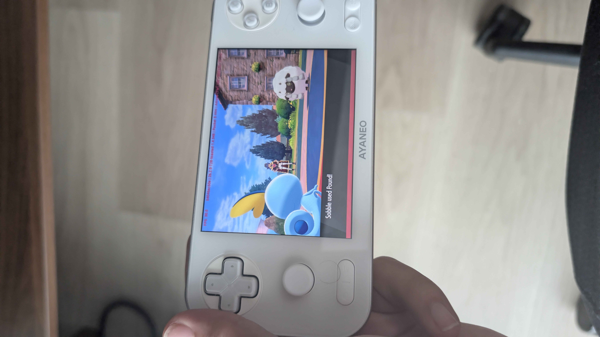
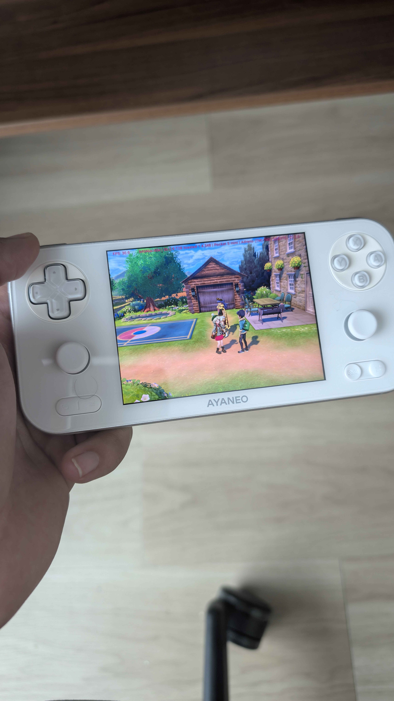

# Pokémon Sword v1.3.2 — 4:3 + UI fix verified working

Status: **fully working / field verified**

This documents the confirmed 4:3 aspect-ratio fix for **Pokémon Sword v1.3.2** on the **AYANEO Pocket S Mini** running **Eden nightly**. The Pocket S Mini display is used as a native **1280x960 landscape / 4:3** target, so the correct fix is to make both the world projection path and the UI sprite/layout path use 4:3.

## Confirmed target

- Game: **Pokémon Sword**
- Title ID: `0100ABF008968000`
- Version: **v1.3.2**
- Build ID: `A3B75BCD3311385AEED67FBEEB79CBB7BF02F471`
- Device: **AYANEO Pocket S Mini**
- Emulator: **Eden nightly**
- Native display target: **1280x960 landscape / 4:3**
- Working mod name in this repo: `[4:3 + UI fix v1.3.2]`
- Historical on-device folder name: `4-3-UIFix-B-v1.3.2`
- First working commit: `e3a0647` (`Pokemon Sword v1.3.2: 4:3 + UI fix (working)`)

## Final recommendation

Use **4:3 for both game world and UI**.

Do **not** rely on a global emulator stretch setting. The game has at least two relevant aspect paths:

- world/camera path: 4:3 float
- UI/sprite/layout path: 4:3 double

Leaving the UI double at the inherited 21:9.5 value, or pinning it to 16:9, causes menu/HUD/icon problems even when the world itself is 4:3.

## Working patch

Mod file:

```text
generated-narrow-aspect/Pokemon Sword [0100ABF008968000][mods]/[4:3 + UI fix v1.3.2]/exefs/1.3.2.pchtxt
```

### World aspect float

Source/file offsets:

```text
0x00607664
0x00607668
```

Target value:

```text
4:3 float = 0x3faaaaab
```

Patch bytes:

```text
00607664 69559552 // World aspect float low16 = 0xAAAB (4:3f)
00607668 49F5A772 // World aspect float high16 = 0x3FAA (4:3f)
```

### UI aspect double

Source/file offsets:

```text
0x00607de8
0x00607dec
```

Target value:

```text
4:3 double = 0x3FF5555555555555
```

Patch bytes:

```text
00607de8 A9AACAF2 // movk x9, #0x5555, lsl #32
00607dec A9FEE7F2 // movk x9, #0x3FF5, lsl #48
```

Eden's IPSwitch log reports these with the `@flag offset_shift 0x100` adjustment:

```text
0x00607EE8 = A9AACAF2
0x00607EEC = A9FEE7F2
```

## Validation evidence

### Battle/HUD and menu evidence



The battle screenshot shows Pokémon Sword running on the white AYANEO Pocket S Mini in a native 4:3 window. The battle text box, HP/name bars, and Pokémon sprites are visible with natural proportions. This is the important UI/HUD proof point: the UI no longer looks like the previous broken 16:9/21:9-derived candidate where icons/sprites were horizontally wrong.

Visible overlay text also confirms the runtime context includes **Pocket S mini**, **Adreno 740**, and an FPS counter around **30 FPS**.

### World-rendering evidence



The overworld screenshot shows the player standing outside a building. The scene fills the Pocket S Mini's 4:3 display without a global-stretch look: characters, building geometry, trees, and props appear natural on the native panel.

Visible overlay text again shows the test running on **Pocket S mini / Adreno 740**, with FPS around **30 FPS**.

## Iteration history

### Base 4:3 WIP

- World float changed to 4:3.
- UI aspect double was still inherited from the upstream 21:9.5 mod path.
- Result: world was corrected, but UI/HUD remained wrong because UI still used the wide aspect path.

### Candidate A

- World float: 4:3
- UI double: 16:9
- Result: text rendered acceptably, but menu/battle icons and sprites were mis-scaled or misaligned.
- Conclusion: the UI double drives sprite X-scaling / layout, not just text anchoring.

### Candidate B

- World float: 4:3
- UI double: 4:3
- Result: **fully working**.
- This is the shipped mod: `[4:3 + UI fix v1.3.2]`.

### Candidate C

- World float: 4:3
- UI double: 3:2
- Result: superseded by Candidate B; not needed for Pocket S Mini's native 4:3 panel.

## Practical notes

- Enable only one Pokémon Sword aspect-ratio mod at a time in Eden. Do not enable the old `[4:3 WIP v1.3.2]` together with `[4:3 + UI fix v1.3.2]`; the patch sites overlap.
- If Eden's mod-manager UI is unreliable, edit `config.ini` directly while Eden is force-stopped, then confirm the active patch by grepping `IPSwitchCompiler` in `eden_log.txt`.
- Treat `IPSwitchCompiler` `Patching value at offset ...` lines as the ground truth for what actually applied.
- Remember the `+0x100` offset shift between source offsets and Eden log offsets.

## Conclusion

For **Pokémon Sword v1.3.2 on AYANEO Pocket S Mini**, the working solution is:

```text
4:3 world float + 4:3 UI double
```

This is now considered **fully working** for the Pocket S Mini's native 1280x960 / 4:3 display.
